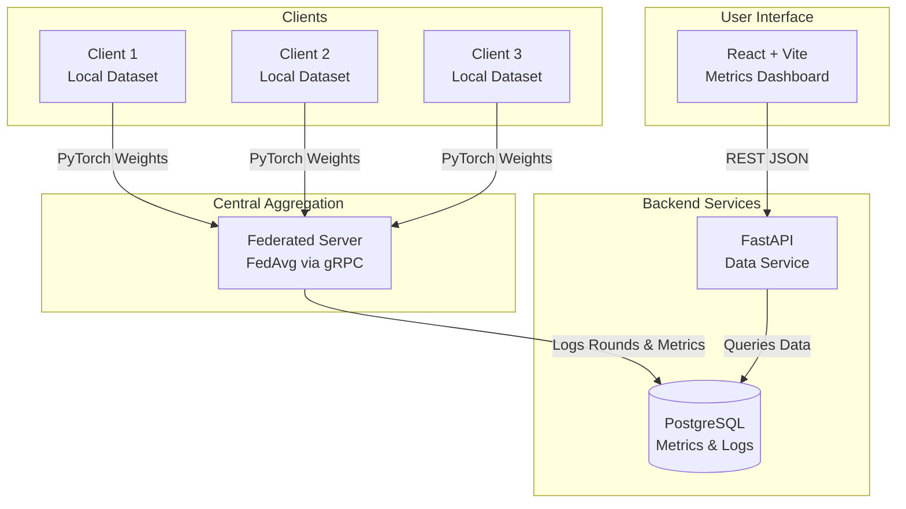

# Federated Fraud Shield

A production-ready Federated Learning system designed for detecting anomalies such as credit card fraud across multiple distributed banking clients. 

By utilizing a combination of Autoencoders and Isolation Forests, this system identifies fraudulent transactions while ensuring raw, sensitive financial data remains strictly local to each client. Model weights are aggregated centrally using FedAvg, with performance metrics dynamically visualized on a React dashboard.

## Key Features

- **Federated Learning (FedAvg):** Clients train PyTorch Autoencoders locally. Only model weights are transmitted to the central server via gRPC, ensuring strict data privacy.
- **Ensemble Anomaly Detection:** Each client leverages a hybrid approach combining Autoencoder reconstruction error with an Isolation Forest to accurately score and flag anomalous transactions.
- **Explainable AI (XAI):** Flagged anomalies are locally explained using SHAP (SHapley Additive exPlanations), delivering feature importance scores to clarify why a specific transaction was flagged.
- **Real-time Monitoring:** A Python FastAPI backend serves data from a PostgreSQL database directly to a React frontend.

## Dashboard & Visualization

The custom-built React dashboard (`localhost:8501`) dynamically visualizes the global FedAvg learning curve, precision-recall metrics, and local SHAP feature importance plots for every active client.

### Screenshots


## Architecture



## Setup and Execution

1. **Prepare the Data:**
   Generate the dataset partitions across clients:
   ```bash
   pip install -r requirements.txt
   python data/prepare_data.py
   ```

2. **Run with Docker Compose:**
   Start the entire stack (Database, FastAPI, gRPC Server, Clients, React Dashboard):
   ```bash
   docker-compose up -d --build
   ```

3. **View the Dashboard:**
   Open your browser and navigate to http://localhost:8501.

## Technologies Used
- **Machine Learning**: Python, PyTorch, Scikit-Learn, SHAP
- **Networking**: gRPC, Protocol Buffers, FastAPI
- **Database**: PostgreSQL, SQLAlchemy
- **Frontend**: React, Vite, Recharts, CSS
- **DevOps**: Docker, Docker Compose
