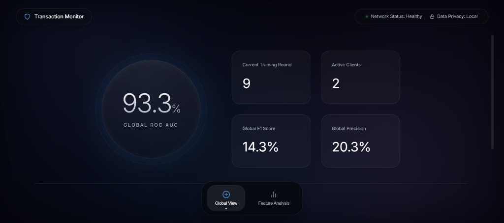
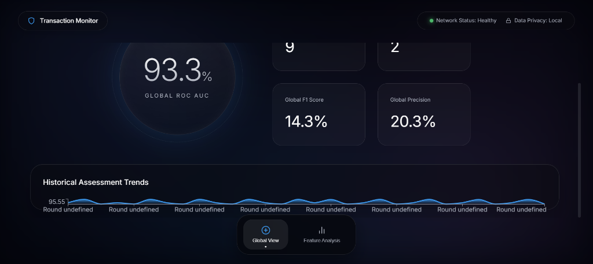
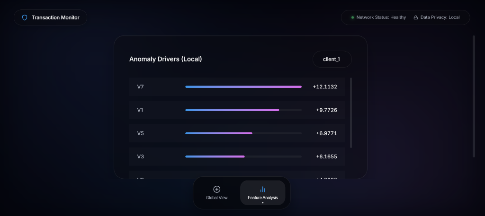
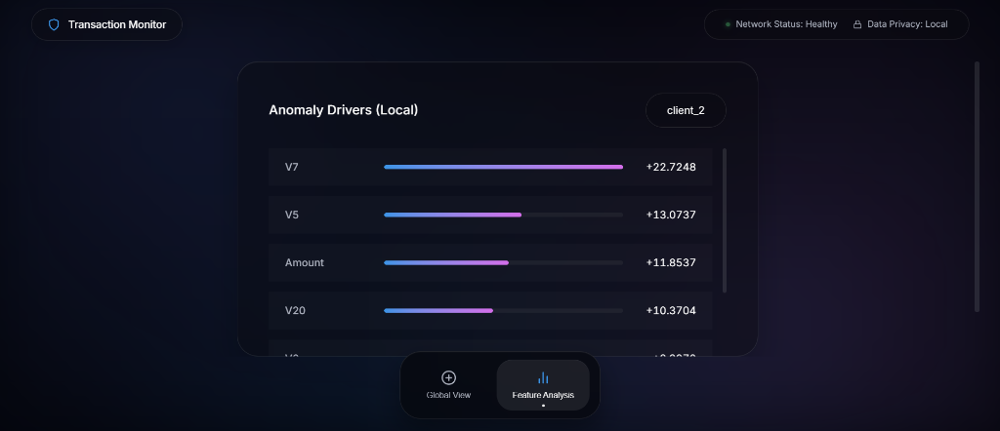

# Federated Anomaly Detection for Financial Transactions

This project implements a Federated Learning system for detecting anomalies (e.g., credit card fraud) across multiple simulated banking clients. It uses a combination of an Autoencoder and an Isolation Forest to identify anomalous transactions while keeping the raw data local to each client. The system aggregates model weights centrally and displays performance metrics on a Streamlit dashboard.

## Results & Verification
Running end-to-end on the real Kaggle Credit Card Fraud dataset across 3 federated clients with GPU acceleration enabled:

* **Convergence:** The Federated Autoencoder converged smoothly within 5 FedAvg rounds (Loss reduced from 0.80 -> ~0.64).
* **Performance:** The ensemble models achieved an excellent ROC AUC of **0.952+** on detecting real fraudulent transactions.
* **Drift:** Model monitoring recorded consistent data drift scores around ~0.006 across the client partitions.
* **Explainability:** SHAP values were generated for all anomalous transactions and successfully stored in `data/explanations/`.

The React dashboard (`localhost:8501`) dynamically visualizes the global FedAvg learning curve alongside precision-recall metrics and SHAP summary plots.

### Dashboard Screenshots





## Architecture

```text
+-------------------+       +-------------------+       +-------------------+
|     Client 1      |       |     Client 2      |       |     Client 3      |
| (Local Dataset)   |       | (Local Dataset)   |       | (Local Dataset)   |
|                   |       |                   |       |                   |
| - IsolationForest |       | - IsolationForest |       | - IsolationForest |
| - Autoencoder     |       | - Autoencoder     |       | - Autoencoder     |
| - SHAP Explainer  |       | - SHAP Explainer  |       | - SHAP Explainer  |
+---------|---------+       +---------|---------+       +---------|---------+
          | gRPC                      | gRPC                      | gRPC
          |                           |                           |
          +---------------------------+---------------------------+
                                      | (Send Model Weights & Metrics)
                                      V
                            +-------------------+
                            |  Federated Server |
                            |    (FedAvg)       |
                            |                   |
                            +---------|---------+
                                      | Log Metrics & Rounds
                                      V
                            +-------------------+
                            |    PostgreSQL     |
                            |    Database       |
                            +---------|---------+
                                      | Read Metrics
                                      V
                            +-------------------+
                            |    Streamlit      |
                            |    Dashboard      |
                            +-------------------+
```

## Features

- **Federated Learning (FedAvg):** Clients train a PyTorch Autoencoder locally and send only the model weights to the central server using gRPC.
- **Local Anomaly Detection:** Each client uses an ensemble of an Autoencoder (reconstruction error) and an Isolation Forest to score transactions.
- **Explainability (SHAP):** Flagged anomalies are explained locally using SHAP, providing feature importance scores for why a transaction was flagged.
- **Statistical Drift Detection:** Calculates distribution shifts between client datasets over time.
- **Dashboard:** A Streamlit web application connects to the PostgreSQL database to display real-time ROC/AUC, precision, recall, F1 scores, and SHAP explainability.

## Setup and Execution

1. **Prepare the Data:**
   Generate the synthetic dataset split across clients:
   ```bash
   pip install -r requirements.txt
   python data/prepare_data.py
   ```

2. **Run with Docker Compose:**
   Start the entire stack (Database, Server, Clients, Dashboard):
   ```bash
   docker-compose up --build
   ```

3. **View Dashboard:**
   Open your browser and navigate to `http://localhost:8501`.

## Technologies Used
- Python, PyTorch, Scikit-Learn
- gRPC, Protocol Buffers
- PostgreSQL, SQLAlchemy
- Streamlit, Plotly
- Docker, Docker Compose
